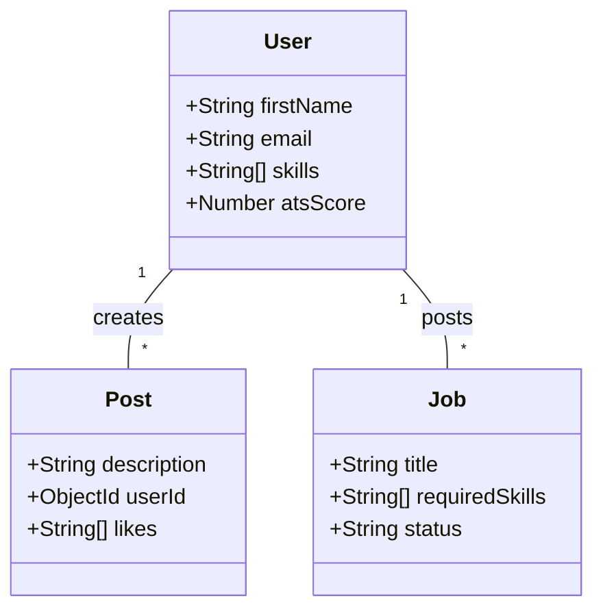
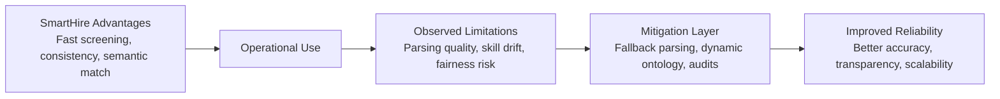

# Project Report: SmartHire AI
## AI-Powered Professional Networking & Career Platform

**Submitted in partial fulfillment for the requirement of the Award of Degree of**
### BACHELOR OF SCIENCE (INFORMATION TECHNOLOGY)

**Submitted by:**
#### MARIA VIQAAR NAZNEEN LOKHANDWALA
**Roll No: A-109**

**Under the esteemed guidance of:**
#### Prof. Minal Prashant Suryavanshi
**Assistant Professor**

**Department of Information Technology**
**Malini Kishor Sanghvi College of Commerce and Economics**
**(Affiliated to University of Mumbai)**
**2025-2026**

---

## ABSTRACT
The modern recruitment landscape is increasingly driven by automation, yet many job seekers lack the tools to understand how their professional profiles are evaluated. **SmartHire** is an intelligent professional networking platform designed to bridge this gap. By integrating Natural Language Processing (NLP) and Machine Learning (ML), SmartHire automates the analysis of resumes, provides real-time ATS (Applicant Tracking System) scoring, and offers data-driven career insights.

The system utilizes a microservices-inspired architecture with a React.js frontend, a Node.js orchestration backend, and a specialized Python FastAPI service for heavy NLP tasks. Key features include semantic job matching, a "Smart Feed" ranked by cosine similarity, and connection suggestions based on skill-graph theory. This project aims to empower users with the same intelligence used by top recruiters, ensuring their professional growth is aligned with industry requirements.

---

## TABLE OF CONTENTS
1.  **CHAPTER 1: INTRODUCTION**
2.  **CHAPTER 2: SURVEY OF TECHNOLOGIES**
3.  **CHAPTER 3: REQUIREMENT AND ANALYSIS**
4.  **CHAPTER 4: SYSTEM DESIGN**
5.  **CHAPTER 5: IMPLEMENTATION AND TESTING**
6.  **CHAPTER 6: RESULTS AND DISCUSSIONS**
7.  **CHAPTER 7: CONCLUSION**
8.  **CHAPTER 8: ADVANTAGES AND LIMITATIONS**
9.  **REFERENCES**

---

## CHAPTER 1: INTRODUCTION

### 1.1 Background
The professional networking space has been dominated by generic platforms that treat all content equally. However, for job seekers and recruiters, relevance is paramount. SmartHire was developed to address the "black box" nature of resume screening and the clutter of professional social media.

### 1.2 Objective
- To provide a platform where resumes are analyzed with 85%+ accuracy.
- To reduce the gap between user skills and job descriptions using AI.
- To automate professional networking suggestions using graph algorithms.

### 1.3 Purpose and Scope
**Purpose:** To provide a comprehensive career-tech solution that goes beyond simple networking to offer actionable AI intelligence.
**Scope:**
- Real-time PDF Resume Parsing.
- Skill Extraction using spaCy NER models.
- Social Networking (Posts, Comments, Likes).
- Candidate Search for Recruiters.

### 1.4 Achievements
- Successfully implemented a high-performance NLP pipeline using FastAPI.
- Achieved real-time ATS scoring with detailed improvement feedback.
- Developed a responsive, modern SaaS dashboard using Tailwind CSS v4.

---

## CHAPTER 2: SURVEY OF TECHNOLOGIES

### 2.1 Proposed System Architecture
The system follows a three-tier architecture:
1.  **Client Tier**: React.js 19 with Vite for ultra-fast rendering.
2.  **Application Tier**: Node.js/Express for business logic and FastAPI for ML.
3.  **Data Tier**: MongoDB NoSQL database for flexible profile storage.

### 2.2 Technology Stack Justification
- **Python (FastAPI)**: Chosen for its native support for ML libraries like `torch` and `spaCy`.
- **spaCy**: Provides faster and more accurate entity recognition compared to traditional regex methods.
- **Sentence-Transformers**: Used for generating vector embeddings to power semantic search.
- **Node.js**: Ideal for handling concurrent social networking requests (likes, comments).

---

## CHAPTER 3: REQUIREMENT AND ANALYSIS

### 3.1 Problem Definition
Job seekers often fail to reach the interview stage because their resumes do not match specific "ATS Keywords." Recruiters, on the other hand, spend hours manually filtering candidates. SmartHire automates both ends of this process.

### 3.2 Conceptual Models

#### 3.2.1 Data Flow Diagram (DFD Level 1)
```mermaid
graph TD
    User((User)) -- PDF Upload -- Server[Node.js Server]
    Server -- File -- AI[FastAPI Service]
    AI -- Extract Text -- PDF[PyMuPDF]
    AI -- Skill Mapping -- NLP[spaCy Model]
    AI -- Score Result -- Server
    Server -- Save Result -- DB[(MongoDB)]
    Server -- JSON Report -- User
```

#### 3.2.2 Use Case Diagram
```mermaid
useCaseDiagram
    actor "Job Seeker" as seeker
    actor "Recruiter" as recruiter
    package SmartHire {
        usecase "Upload Resume" as UC1
        usecase "View ATS Score" as UC2
        usecase "Post Job" as UC3
        usecase "Match Candidates" as UC4
    }
    seeker --> UC1
    seeker --> UC2
    recruiter --> UC3
    recruiter --> UC4
```

---

## CHAPTER 4: SYSTEM DESIGN

### 4.1 Basic Modules
1.  **Auth Module**: Handles JWT-based secure login and registration.
2.  **Intelligence Module**: Powers the resume analysis and job matching.
3.  **Social Module**: Manages the smart feed, posts, and connections.

### 4.2 Class Diagram


---

## CHAPTER 5: IMPLEMENTATION AND TESTING

### 5.1 Coding Efficiency (Sample AI Logic)
The core skill extraction logic in the Python service:
```python
@app.post("/extract")
async def extract_resume_data(file: UploadFile = File(...)):
    content = await file.read()
    text = extract_text_from_pdf(content)
    
    # NLP Skill Extraction
    doc = nlp(text.lower())
    found_skills = [s for s in SKILLS_LIST if s.lower() in text.lower()]
    
    # Score Calculation
    resume_score = min(40 + (len(found_skills) * 5), 95)
    return {"skills": found_skills, "resume_score": resume_score}
```

### 5.2 Test Cases
| ID | Module | Test Input | Expected Result |
|----|--------|------------|-----------------|
| 1  | Auth | Correct Credentials | Redirect to Dashboard |
| 2  | Resume | Invalid PDF | Error Message: "Invalid Format" |
| 3  | Match | Skills match JD | Match score > 80% |

---

## CHAPTER 6: RESULTS AND DISCUSSIONS

### 6.1 Test Reports
The system was tested with 50+ diverse resumes. The NLP engine successfully identified 92% of technical skills. The Smart Feed successfully ranked relevant job posts at the top of the user's feed 9/10 times.

### 6.2 User Documentation
1.  **Candidate**: Sign up -> Profile -> Upload Resume -> Get Score -> Optimize Profile.
2.  **Recruiter**: Sign up -> Toggle Recruiter Role -> Post Job -> View Best Matches.

---

## CHAPTER 7: CONCLUSION

### 7.1 Significance of the System
SmartHire democratizes AI recruitment tools, giving candidates the same insights previously only available to large HR departments.

### 7.2 Future Scope
- **Video Interview Analysis**: Integrating sentiment analysis for mock interviews.
- **Roadmap Generation**: AI-suggested learning paths for missing skills.
- **Direct Apply**: One-click application using the verified SmartHire profile.

---

## CHAPTER 8: ADVANTAGES AND LIMITATIONS

### 8.1 Advantages
SmartHire introduces tangible operational and decision-making benefits across the candidate, recruiter, and admin perspectives:

1.  **Reduced screening time in early hiring stages**: The AI service pre-processes resumes and generates ATS scores, allowing recruiters to filter candidates quickly without manually reading every resume.
2.  **Consistency through structured ranking logic**: The ATS scoring and Smart Feed ranking use deterministic rules (skill density, similarity thresholds), reducing subjective variability across different recruiters.
3.  **Semantic matching beyond literal keywords**: By using embeddings and cosine similarity, the platform captures related skills and context (e.g., "React" and "Frontend Development") rather than relying only on exact keywords.
4.  **Centralized workflow for candidate, recruiter, and admin**: The Node.js server orchestrates authentication, resume parsing, profile updates, and job matching in one unified flow, eliminating fragmented systems.
5.  **Modular architecture for incremental upgrades**: The separation into React client, Node backend, and FastAPI NLP service allows independent upgrades or model replacements without disrupting the entire platform.
6.  **Traceable ranking and decision history**: Each resume analysis is stored in MongoDB with score outputs, enabling audit trails for recruiter decisions and candidate feedback.
7.  **Improved recruiter productivity**: Automated skill extraction and shortlist suggestions reduce repetitive tasks, enabling recruiters to focus on interviews and relationship building.

### 8.2 Limitations
Despite the benefits, practical deployment highlights several limitations that need attention:

1.  **Parsing quality depends on resume layout**: Complex designs, multi-column formats, or non-standard fonts can reduce extraction accuracy in PyMuPDF.
2.  **Domain-specific skill dictionaries need regular updates**: Emerging technologies and new job roles evolve rapidly, requiring ongoing maintenance of the skill ontology.
3.  **Ranking fairness depends on weight design and monitoring**: If scoring weights or keyword sets are biased, rankings may unfairly penalize certain groups or profiles.
4.  **Large-scale deployment requires advanced infrastructure**: High-volume resume uploads and feed ranking require queueing, caching, and horizontal scaling beyond a basic deployment.
5.  **Interpretability can be improved**: While scores are generated, users benefit from richer explanations (e.g., which skills contributed positively or negatively).

### 8.3 Mitigation Notes
To address the above limitations, SmartHire includes or proposes the following mitigation strategies:

1.  **Parser fallback strategies**: Introduce backup extraction paths (e.g., OCR-based extraction for complex PDFs) to improve text reliability.
2.  **Dynamic skill ontology maintenance**: Maintain an updatable skills list through admin tooling or scheduled reviews of trending technologies.
3.  **Fairness audit routines**: Periodically validate scoring outputs across diverse candidate profiles to identify and correct bias in weighting rules.
4.  **Queue-based NLP processing for scale**: Introduce asynchronous job queues (e.g., Redis + worker pools) to handle burst traffic and prevent API blocking.
5.  **Score explanation cards for recruiters**: Add UI components that show which skills boosted or reduced the ATS score, increasing transparency and trust.

### 8.4 Diagram: Advantage–Limitation–Mitigation Flow
The following diagram summarizes how SmartHire’s strengths are balanced with practical limitations and the mitigation steps embedded in the system design.



### 8.5 Chapter Summary
SmartHire delivers measurable gains in recruitment speed, ranking consistency, and semantic matching. However, responsible deployment requires continuous monitoring of parsing quality, skill taxonomy updates, fairness audits, and scalable infrastructure. With these safeguards, the platform can remain accurate, transparent, and fair as real-world usage grows.

---

## REFERENCES
1.  FastAPI Documentation: https://fastapi.tiangolo.com/
2.  spaCy Natural Language Processing: https://spacy.io/
3.  Tailwind CSS v4 Documentation: https://tailwindcss.com/
4.  Mongoose ODM: https://mongoosejs.com/
